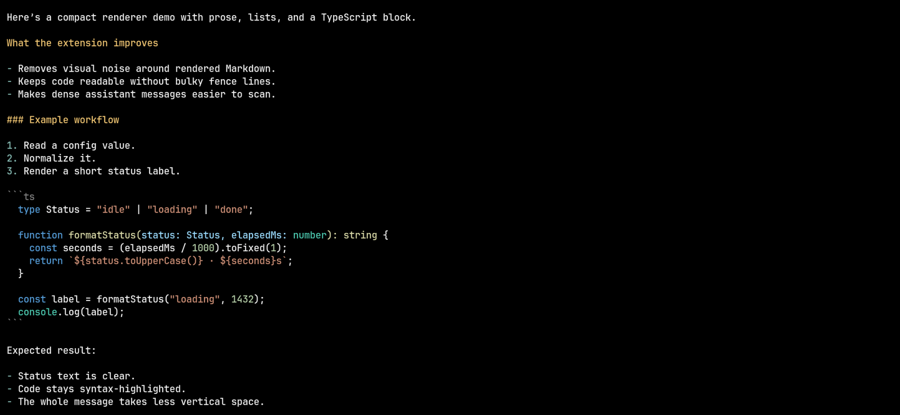
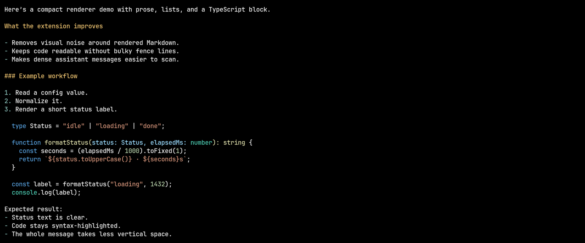

# Pi Response Renderer

This Pi extension makes assistant responses more compact by tightening extra blank lines and hiding Markdown code fence markers.

It applies a few small rendering tweaks:

- hides the visible ``` fence lines around rendered Markdown code blocks in assistant messages
- collapses some extra blank lines between plain paragraph lines
- removes italic ANSI styling from assistant message output

The goal is a cleaner transcript with less visual noise while keeping the message content itself unchanged.

## Install

```sh
pi install git:github.com/zigai/pi-tweaks
```

The extension only changes how messages are rendered in the UI. It does not rewrite saved conversation content.

## Screenshots

Before:



After:


